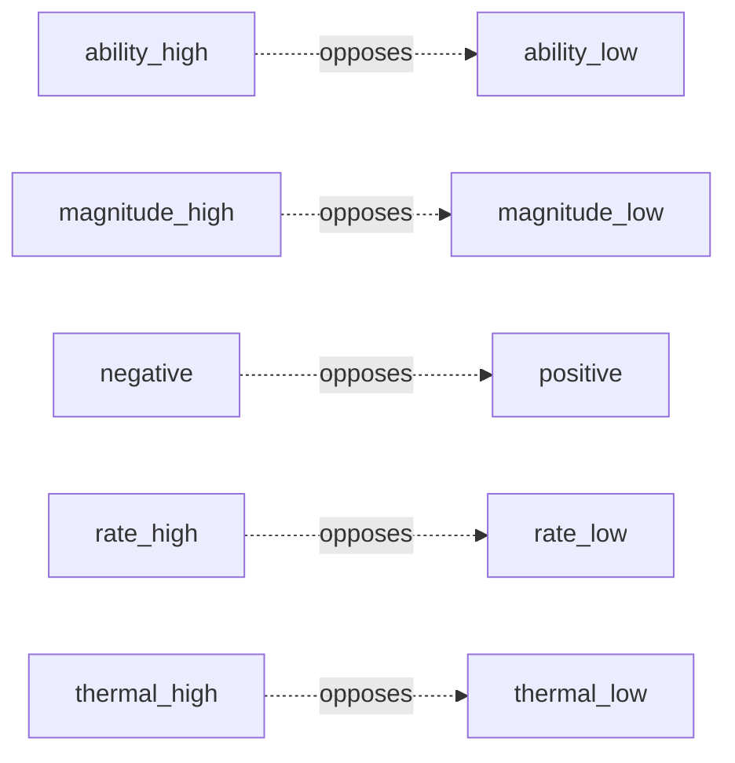

# Category tree

Visual overview of the category ontology derived from [`categories.csv`](categories.csv) and [`category_relations.csv`](category_relations.csv). Generated for inspection only (not part of the converter pipeline).

## Legend

| Source | Meaning |
|--------|---------|
| **Hierarchy** | Parent → child links from `categories.csv` (`parent_category` → `category_name`). Structural tree only. |
| **Opposition** | Pairs with `ontology_relation = opposite_of` in `category_relations.csv` (antonym / opposing secondaries). |
| **Omitted** | Sibling links (`sibling_of`), shared-tag links (`shares_domain_tag`), and `is_a` duplicates are not drawn here. |

Directed edges in `category_relations.csv` use `category_id_a` as source and `category_id_b` as target. The `ontology_relation` column labels each edge (e.g. `is_a`, `sibling_of`, `opposite_of`, `is_a_type_of`, `grows_on`).

**Counts:** 30 nodes (1 root, 5 primaries, 24 secondaries), 5 opposition pairs.

---

## Hierarchy

```mermaid
flowchart TB
  attribute["attribute"]

  attribute --> cognition
  attribute --> emotion
  attribute --> size
  attribute --> speed
  attribute --> temperature

  cognition --> ability_high
  cognition --> ability_low
  cognition --> mental
  cognition --> mind
  cognition --> reasoning

  emotion --> affect
  emotion --> feeling
  emotion --> mood
  emotion --> negative
  emotion --> positive

  size --> dimension
  size --> magnitude_high
  size --> magnitude_low
  size --> physical
  size --> scale

  speed --> motion
  speed --> rate_high
  speed --> rate_low
  speed --> temporal
  speed --> velocity

  temperature --> climate
  temperature --> heat
  temperature --> thermal_high
  temperature --> thermal_low
```



---

## Oppositions

Antonym pairs (`relation_score = -0.7`):



| ID pair | Categories | Relation row |
|---------|------------|--------------|
| 2 ↔ 3 | ability_high ↔ ability_low | 6 |
| 11 ↔ 12 | magnitude_high ↔ magnitude_low | 49 |
| 17 ↔ 19 | negative ↔ positive | 66 |
| 20 ↔ 21 | rate_high ↔ rate_low | 69 |
| 28 ↔ 29 | thermal_high ↔ thermal_low | 85 |

---

## ASCII tree

```
attribute
├── cognition
│   ├── ability_high
│   ├── ability_low
│   ├── mental
│   ├── mind
│   └── reasoning
├── emotion
│   ├── affect
│   ├── feeling
│   ├── mood
│   ├── negative
│   └── positive
├── size
│   ├── dimension
│   ├── magnitude_high
│   ├── magnitude_low
│   ├── physical
│   └── scale
├── speed
│   ├── motion
│   ├── rate_high
│   ├── rate_low
│   ├── temporal
│   └── velocity
└── temperature
    ├── climate
    ├── heat
    ├── thermal_high
    └── thermal_low
```

---

## Node reference

| id | category_name | parent_category |
|----|---------------|-----------------|
| 1 | attribute | |
| 2 | ability_high | cognition |
| 3 | ability_low | cognition |
| 4 | affect | emotion |
| 5 | climate | temperature |
| 6 | cognition | attribute |
| 7 | dimension | size |
| 8 | emotion | attribute |
| 9 | feeling | emotion |
| 10 | heat | temperature |
| 11 | magnitude_high | size |
| 12 | magnitude_low | size |
| 13 | mental | cognition |
| 14 | mind | cognition |
| 15 | mood | emotion |
| 16 | motion | speed |
| 17 | negative | emotion |
| 18 | physical | size |
| 19 | positive | emotion |
| 20 | rate_high | speed |
| 21 | rate_low | speed |
| 22 | reasoning | cognition |
| 23 | scale | size |
| 24 | size | attribute |
| 25 | speed | attribute |
| 26 | temperature | attribute |
| 27 | temporal | speed |
| 28 | thermal_high | temperature |
| 29 | thermal_low | temperature |
| 30 | velocity | speed |
